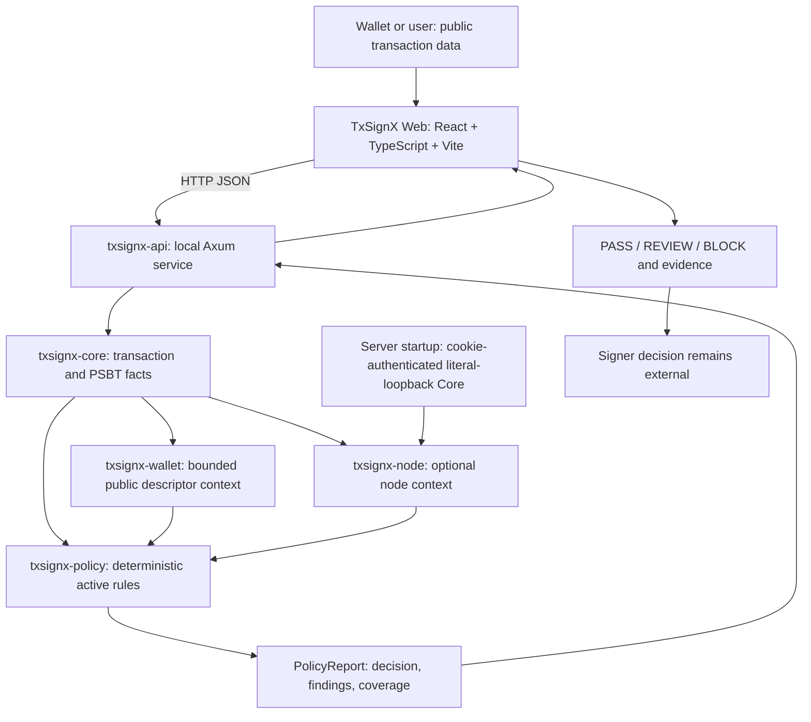

# Architecture

TxSignX separates derived Bitcoin facts, contextual checks and security policy from HTTP transport and presentation. Rust is the only authority for decisions.

| Component | Responsibility | Boundary |
| --- | --- | --- |
| Core | Decode raw transactions and PSBT v0; report input/output, fee and metadata facts | Does not infer network or authenticate supplied prevouts against the chain |
| Wallet | Match scripts against public external/internal descriptors within a bounded derivation window | A match is contextual classification, not proof of control of a private key |
| Node | Query configured Bitcoin Core and bind its context to the inspected transaction | Node reports reflect that node's state and trustworthiness |
| Policy | Evaluate Rust rules; produce findings, severity, decision and coverage | Rules consume derived facts; the browser does not reproduce them |
| API | Validate transport inputs and orchestrate those crates | No signing, finalization or broadcast endpoint |
| Web | Collect inputs; render factual reports and explicit errors; export JSON on request | Never computes a TG finding or substitutes its own decision |

The existing CLI is another consumer of the Rust crates. Its advanced Regtest-only broadcast capability is separate from the M6 web/API path.

## Three preflight modes

1. PSBT plus policy configuration: evaluate the supplied facts without wallet or node context.
2. Add wallet context: classify inputs and explicitly expected change using public descriptors.
3. Add configured node context: use the API server's node, with wallet context and a matching explicit network.

No mode upgrades unavailable facts into zero values. No node configuration is accepted from browser JSON. See [security model](security-model.md) and [API contract](api.md).
