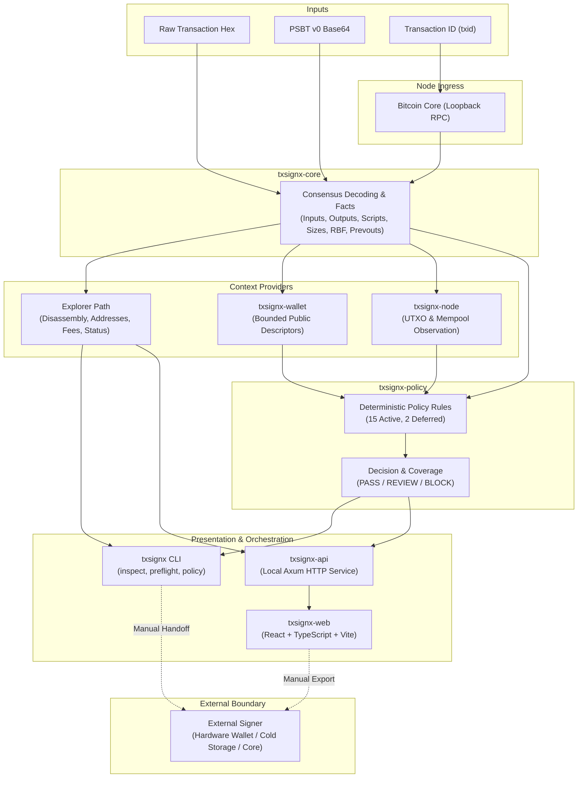

# Architecture

TxSignX separates derived Bitcoin facts, contextual checks, and security policy from HTTP transport and presentation. Rust is the sole authority for transaction analysis and policy decisions.

## System architecture



### Conceptual data flow

```text
                 INPUT
                   │
        ┌──────────┴──────────┐
        │                     │
     RAW TX / PSBT           TXID
        │                     │
        │                Bitcoin Core
        │                     │
        └──────────┬──────────┘
                   ↓
             txsignx-core
       transaction / PSBT facts
                   │
       ┌───────────┼───────────┐
       │           │           │
   wallet ctx   node ctx    explorer
       │           │           │
       └──────┬────┘           │
              ↓                │
        txsignx-policy         │
              │                │
       PASS/REVIEW/BLOCK       │
              └───────┬────────┘
                      ↓
                  CLI / API
                      ↓
                    Web
                      ↓
                External signer
```

## Component responsibilities and boundaries

| Component | Responsibility | Boundary |
| --- | --- | --- |
| **`txsignx-core`** | Decodes raw transactions and PSBT v0 using `rust-bitcoin`; extracts input/output facts, locktime, sequence, witness items, size, weight, and vsize; computes opcode disassembly and derives output addresses when network is provided. | Does not infer network without user specification; does not fabricate previous-output values or fees without prevout context. |
| **`txsignx-node`** | Connects to local Bitcoin Core via literal-loopback RPC (`127.0.0.1` or `[::1]`) and cookie authentication; fetches transactions by txid; resolves previous outputs single-hop; checks node readiness, block count, chain tip, UTXO state, and mempool acceptance. | Operates only on literal loopback; strictly bounded to 5-second timeout and 1 MiB response limit; does not broadcast on mainnet or manage network transport outside loopback. |
| **`txsignx-wallet`** | Translates public external and internal descriptors across a bounded derivation window (default 1,000) using `bdk_wallet` and `miniscript`; identifies wallet-controlled inputs and verifies expected change outputs. | No private keys, seed phrases, xprvs, or WIF; matching is contextual classification, not proof of spending authority. |
| **`txsignx-policy`** | Evaluates deterministic Rust rules over derived facts and available contexts; produces a structured `PolicyReport` with findings, severity, explicit coverage (`Evaluated`, `Partially Evaluated`, `Not Evaluated`), and final decision. | Rules consume derived facts only; zero heuristic scoring or AI decision-making; deferred rules are never evaluated. |
| **`txsignx-cli`** | User-facing terminal binary providing `tx inspect`, `psbt inspect`, `psbt preflight`, and `policy list`; outputs human-readable styled text or pure machine-readable JSON. | Enforces mutual exclusivity of inputs; respects `NO_COLOR` and non-TTY piping; zero ANSI leaks into JSON. |
| **`txsignx-api`** | Local Axum HTTP daemon exposing versioned endpoints for transaction inspection, PSBT preflight, and policy registry exploration. | Local service only; enforces strict CORS, Host header validation, and payload size bounds; no signing or arbitrary broadcast endpoints. |
| **`txsignx-web`** | Modern React interface providing three inspection modes: PSBT v0 preflight, Raw Transaction explorer, and Transaction ID explorer. | Presentation only; never computes policy findings, stores node credentials, or overrides the Rust engine's decisions. Zero local/session browser persistence. |

## Key architectural principles

1. **Dual-path architecture**: The **Transaction Explorer** path operates completely independently of policy evaluation (inspecting raw transaction hex offline or querying Bitcoin Core by txid). The **Preflight** path uses the exact same derived facts and extends them with wallet and node context for policy evaluation.
2. **Deterministic authority**: Rust is the single source of truth for both transaction analysis and security decisions. The browser, API, and CLI never recompute, guess, or invent transaction facts or risk levels.
3. **Strict separation from signing**: TxSignX is an analyzer, not a signer. Signing decisions, key handling, and broadcast remain outside TxSignX's security boundary.
4. **Server-side credential boundary**: Bitcoin Core RPC credentials remain strictly server-side at the local API boundary. The browser never connects directly to Bitcoin Core and never receives or stores node credentials.
